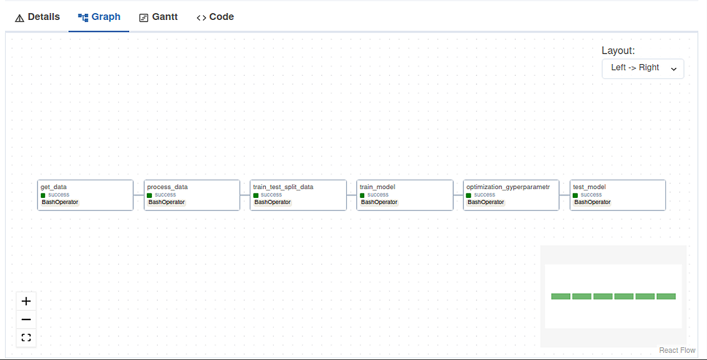

# Николаенко Роман Романович (RomRomich)
# MLOps. Практическое задание №4 (vo-HW)
# Автоматизация администрирования MLOps II

Для выполнения домашнего задания MLOps. Практическое задание №4 (vo-HW) я использовал инструмент Airflow для оптимизации гиперпараметров в домашнем задании. 
В качестве датасета я выбрал "Customer Churn Prediction" (Прогнозирование оттока клиентов) с сайта Kaggle.

Работа с Airflow:
Реализация DAG-файла "Customer Churn Prediction" включает в себя следующие задачи:

* Получение данных (get_data.py) - Этот эксперимент загружает файл train.csv с указанного URL, сохраняет его на локальном компьютере в формате CSV и выводит путь к сохраненному файлу.
* Подготовка данных (process_data.py) - Этот эксперимент загружает данные, выполняет задачи по обработке данных, удаляет определенные столбцы, а затем сохраняет данные.
* Разделение данных (train_test_split_data.py) - Этот эксперимент загружает, разделяет и сохраняет данные из CSV-файла в обучающую и тестовую выборки.
* Обучение модели (train_model.py) - Этот эксперимент обучает модель классификатора на данных X_train и y_train, используя алгоритм градиентного бустинга и сохраняет модель.
* Подбор гиперпараметров (optimization_gyperparametr.py) - Этот эксперимент решает задачу подбора оптимальных гиперпараметров для классификатора XGBClassifier с использованием метода GridSearchCV.
* Тестирование модели (test_model.py) - Этот эксперимент загружает обученную модель классификатора из pickle-файла, выполняет и выводит оценку метрик качества классификатора.

Скриншот ниже показывает структуру работы DAG-файла "Customer Churn Prediction" в Airflow и успешное выполнение задачи.

